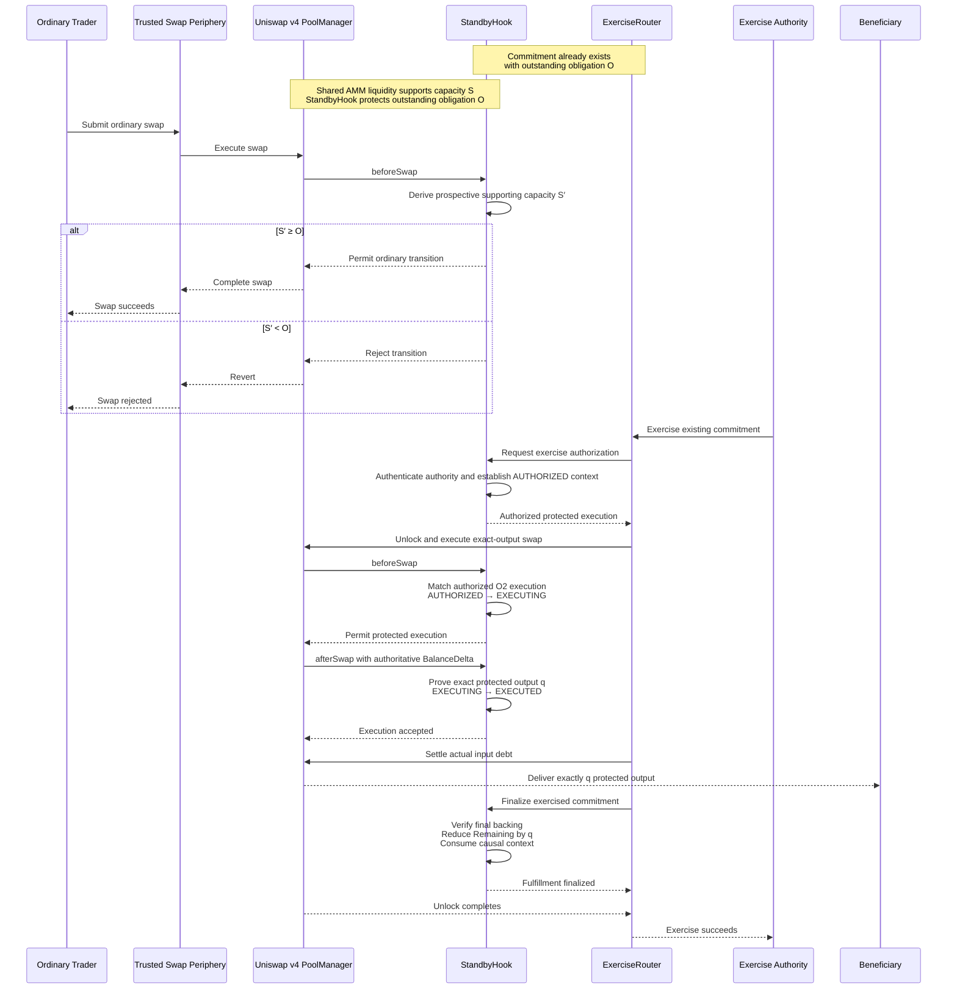
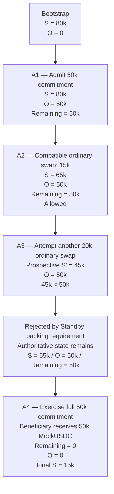

<p align="center">
  
</p>

# Standby

**Execution capacity when you need it.**

Protocol-enforced future execution capacity from shared AMM liquidity.

> **Standby doesn't reserve liquidity. It protects capacity.**

Standby is a Uniswap v4 hook that lets a beneficiary rely on a bounded amount of *future* execution
capacity from a shared pool — without pre-positioning the destination asset, without segregating liquidity,
and without an external guarantor. The liquidity stays in the shared pool and stays usable. What changes is
that a transition which would leave an admitted commitment insufficiently backed can no longer become
authoritative.

---

## The problem

An AMM pool tells you what you can execute *now*. It tells you nothing about what you will be able to
execute later.

Executable capacity is directional and mutable: ordinary swaps and liquidity changes move it, and none of
that activity is adversarial. So an institution that may need a specific quantity of USDC tomorrow — for a
settlement it cannot be sure will happen — has no way to rely on the capacity it can see today.

Its existing options all pay for certainty in advance:

- pre-position the USDC, and carry idle capital against a contingency that may never materialize;
- arrange dedicated or segregated liquidity, and fragment the shared pool;
- rely on a discretionary counterparty at the moment of need.

Meanwhile, liquidity providers value keeping their capital productive and their optionality intact, and
ordinary traders value present access. Every participant is behaving rationally, and the future
availability nobody is responsible for is exactly the thing the beneficiary needs.

That gap is a coordination failure, not misconduct — and it is what Standby is for.

## Who Standby is for

Standby is intended for actors who hold productive onchain assets and face a **bounded, contingent, future**
requirement for a different asset — where the requirement may not materialize at all, and where unwinding
or pre-funding in advance is the expensive part.

Potential users include:

- tokenized-asset issuers and asset managers;
- institutional treasury and settlement operators;
- permissioned onchain markets;
- institutional holders of productive or yield-bearing onchain assets that may later require a bounded
  quantity of another asset for settlement, redemption, collateral, or treasury operations.

These are illustrative classes of actor for whom the primitive could be useful. No institution uses Standby
today, none is presented here as a customer, and none has endorsed it.

### An illustrative institutional example

> An institution holds **$5 million** of tokenized Treasury assets. It may need **$500,000 USDC** tomorrow,
> inside a defined settlement window — and it may not need it at all.

Without Standby its choices are the ones above, applied to a real balance sheet: pre-position the USDC,
arrange dedicated liquidity, lean on a counterparty — or accept uncertainty about whether the AMM capacity
it can see today will still be there tomorrow.

With Standby, a production deployment could instead let it acquire a **bounded future execution commitment**
backed by qualifying shared AMM liquidity. The tokenized assets keep working, the USDC is not pre-positioned,
and the capacity the institution is relying on cannot be drawn away by a transition that would leave the
commitment unbacked.

What that does and does not mean:

- the committed USDC is **not** segregated, escrowed, or moved into Standby custody;
- compatible ordinary use of the same shared liquidity continues while the commitment is outstanding;
- Standby protects the admitted **capacity** boundary, not a price — exercise runs through actual AMM
  execution, at whatever the pool gives at that moment, with ordinary price impact;
- on successful exercise and fulfillment, the Beneficiary receives the protected output directly;
- execution is conditional on the commitment's validity, exercise window, authority, eligibility and
  service-domain conditions — it is not an unconditional guarantee.

The **$5M / $500K** figures above are illustrative framing only. They are not the canonical demo fixture.
The fixture that proves actual implemented behavior is the A1–A4 history further down, denominated in
MockUSDC.

### A commitment is bounded in quantity *and* in time

Every commitment carries an exercise window — `exercisableFrom` and `validUntil` — and the two bounds do
different economic work.

- A valid commitment contributes to Aggregate Capacity Obligation **from admission**, before it is
  exercisable. This is deliberate: the capacity has to already be protected by the time the exercise window
  opens, or the promise would be worth nothing at the moment it matters.
- Authorized exercise is possible only inside the window, `exercisableFrom <= t < validUntil`.
- If exercise succeeds and fulfillment is causally proven, Remaining Entitlement and the corresponding
  Capacity Obligation are reduced by exactly the fulfilled quantity.
- Once `t >= validUntil`, the commitment stops contributing to Capacity Obligation.

> **Expiry releases an obligation. Expiry is not fulfillment.**

When a commitment reaches `validUntil`, any remaining unfulfilled entitlement ceases contributing to
Capacity Obligation. Expiration does not represent that remaining entitlement as fulfilled, and implies no
additional Beneficiary delivery. The practical consequence is that Standby protects a bounded quantity of
future execution capacity for a bounded period, rather than imposing an open-ended constraint on shared
liquidity.

## Why Uniswap v4?

> **A future execution commitment is credible only if it can be enforced where the resource backing the
> commitment changes.**

For Standby, that backing resource is executable AMM capacity — and swaps and liquidity actions are exactly
what move it. A promise recorded beside the pool, in an external ledger, would still be a promise: nothing
in that ledger stops the pool from transitioning into a state in which the promised capacity no longer
exists. Enforcement has to sit at the transitions themselves.

Uniswap v4 hooks provide that boundary. Standby evaluates each backing-affecting pool transition before it
can become authoritative:

- **compatible transition** → allowed;
- **capacity-destroying transition** → rejected;
- **authorized protected exercise** → recognized through the actual AMM execution path.

> **The economic agreement is enforced where the backing state changes.**

## The core idea

Standby coordinates the two sides directly:

- a **Beneficiary** receives a bounded, time-limited **entitlement** to future execution in one protected
  direction;
- the **shared liquidity** backing that entitlement carries a corresponding **obligation**, and keeps
  serving everyone else in the meantime.

The entire arrangement rests on one invariant:

> **Supporting Capacity `S` must remain greater than or equal to Aggregate Capacity Obligation `O`.**

`S` is how much protected output the pool can actually execute right now under the configured service
conditions — derived from live Uniswap v4 state, not from a balance or a TVL number. `O` is the sum of what
Standby currently owes across live commitments. The hook re-derives both on every backing-affecting
transition and refuses any transition whose *prospective* state would break the relation.

Equality is sufficient. Standby requires no reserve margin and no excess buffer beyond `S >= O`.

### "Protect capacity, not reserve liquidity"

Reserving liquidity means taking it out of shared use so it is there later. It is certain, and it is
expensive: the capital stops working for anyone else.

Protecting capacity means leaving the liquidity in the shared pool and constraining only the transitions
that would destroy the capacity an admitted commitment requires. The pool keeps serving ordinary traders up
to the point where serving them would leave the commitment unbacked — and that boundary is enforced by the
protocol rather than promised by a counterparty.

The demonstration below is built to make that difference observable: with a 50,000 MockUSDC commitment
outstanding, an unrelated trader is *served* 15,000 of the same protected output, and then *refused* a
20,000 request — not because the pool ran out, but because that one transition would have left 45,000 of
capacity behind a 50,000 obligation.

## Protocol economics

> **Standby turns shared AMM liquidity into two potentially distinct economic services: immediate execution
> and committed future availability.**

**The capacity purchaser / Beneficiary** receives something economically valuable: a bounded commitment that
qualifying future AMM execution capacity will remain available under the configured conditions, for a
bounded period, without pre-positioning the destination asset.

**Supporting liquidity** bears the corresponding cost. LPs continue participating in compatible AMM activity
— that is the point of the non-reservation property — but while an obligation is live they give up
unconstrained use of the capacity whose removal would leave an admitted commitment insufficiently backed.
The constraint is quantity-bounded, time-bounded, and compatible with continued ordinary use.

**Compensation is a production-path question, not an implemented one.** A production market would plausibly
need to pay for the additional service, in something like the direction `capacity purchaser → capacity
premium → supporting liquidity`, so that liquidity could earn from two services rather than one: ordinary
swap fees for immediate execution, and capacity premiums for committed future availability. What such a
premium should depend on — commitment quantity, duration, capacity utilization and scarcity, market
conditions — is mechanism design that this repository does not attempt.

The reference implementation therefore does **not** implement capacity pricing, LP premium distribution,
capacity auctions, a utilization pricing curve, LP attribution economics, or a capacity marketplace.

Two economic quantities also remain conceptually distinct and should not be conflated: payment for the
future capacity *right*, and the actual input the exerciser must settle when exercise occurs. The reference
implementation settles the second; the first is left to a production mechanism.

## Permissioned institutional markets

Standby's reference realization queries an external onchain `EligibilityRegistry` rather than owning
membership administration as protocol economic state. The registry exposes logically distinct, independently
mutable, fail-closed predicates for the relevant actor and action classes:

- Beneficiary eligibility for the protected service;
- trader eligibility for ordinary permissioned swaps;
- liquidity-action eligibility.

That separation matters for institutional and tokenized-asset markets, where who may hold, trade, or provide
liquidity against an asset is governed externally and changes over time. Standby consumes that authority's
answers; it does not become the authority.

**The Standby reference implementation is not an integration with Uniswap Permissioned Pools.** No such
integration exists here, and none is claimed.

The two ideas are conceptually complementary rather than competing:

> **Permissioning asks:** who may participate?
>
> **Standby asks:** given authorized participants, what future execution capacity may be promised, and which
> subsequent uses of the shared liquidity remain compatible with that promise?

## The realization

| Component               | Responsibility                                                                                     |
| ----------------------- | -------------------------------------------------------------------------------------------------- |
| `StandbyHook`           | All Standby economic truth: service configuration, commitment records, both authoritative derivations, admission (O1), exercise authorization and causal finalization (O2), and backing enforcement on ordinary pool transitions (O3). |
| `ExerciseRouter`        | Coordinates an exercise across the Uniswap unlock boundary. It proposes and settles; it never authorizes, and it never takes custody of the protected output. |
| `EligibilityRegistry`   | The external eligibility authority, with three independently mutable fail-closed predicates. It holds no Standby economic state. |
| `ActorAwareTestRouter`  | A deterministic-local execution perimeter that preserves the originating user's identity across the unlock boundary, so the hook can authenticate who is acting. |
| `MockUSTB` / `MockUSDC` | The demo economic currencies — six decimals, `MockUSTB = currency0`, `MockUSDC = currency1`, protected direction `MockUSTB → MockUSDC`. |

Uniswap v4's `PoolManager` is real, pinned, and unmodified. Nothing about execution or accounting is mocked;
only the two demo currencies are.

## How Standby Executes

The sequence below begins after a Standby commitment has already been admitted and an outstanding obligation `O` exists. It compares ordinary use of the shared AMM liquidity with later authorized exercise of that commitment.



**Both paths use the same shared Uniswap v4 liquidity.** Ordinary swaps execute through PoolManager with StandbyHook checking whether the prospective transition preserves sufficient supporting capacity. For commitment exercise, the authorized Exercise Authority initiates through ExerciseRouter; StandbyHook first authorizes and binds the exact exercise, PoolManager then performs the real exact-output AMM execution, the exerciser settles the resulting input debt, and PoolManager delivers the protected output directly to the Beneficiary. Only after execution, settlement, and delivery are proven does StandbyHook reduce the commitment’s Remaining Entitlement and consume the transaction-scoped causal context.

## What the canonical demo proves

One live pool, one commitment, four actions, in one uninterrupted history:

| Stage         | Supporting Capacity `S` | Obligation `O` | Remaining | Result    |
| ------------- | ----------------------: | -------------: | --------: | --------- |
| Bootstrap     |                  80,000 |              0 |         — | ready     |
| **A1** admit  |                  80,000 |         50,000 |    50,000 | PASS      |
| **A2** swap   |                  65,000 |         50,000 |    50,000 | PASS      |
| **A3** attempt |    prospective **45,000** |       50,000 |    50,000 | **REJECT** |
| after A3      |                  65,000 |         50,000 |    50,000 | unchanged |
| **A4** exercise |                15,000 |              0 |         0 | PASS      |

All quantities are MockUSDC.



- **A1 — Admit Commitment.** A 50,000 MockUSDC future exact-output execution commitment is admitted through
  the production O1 path. `O` becomes 50,000 while `S` does not move and no MockUSDC is segregated:
  the obligation exists, the backing resource stays shared.
- **A2 — Compatible Ordinary Swap.** An unrelated eligible trader takes 15,000 MockUSDC of protected output
  out of the same pool while the full 50,000 obligation is outstanding, and is served. This is the
  non-reservation proof: the commitment bounded how far the shared resource could be drawn down without
  reserving any of it.
- **A3 — Attempt Capacity-Destroying Ordinary Swap.** The same trader, same perimeter, funded, approved and
  inside the service domain, asks for 20,000. The hook's production preview says the transition would leave
  `S′ = 45,000` against `O = 50,000`, and it is refused with
  `StandbyHook__InsufficientProspectiveBacking(45000000000, 50000000000)`. The prospective 45,000 never
  becomes state: after the revert the service still stands at 65,000 / 50,000 / 50,000.
- **A4 — Exercise Commitment.** The same commitment A1 created is exercised in full through the real
  `ExerciseRouter` and actual AMM execution. The authoritative Beneficiary's MockUSDC balance increases by
  exactly 50,000, Remaining Entitlement reaches 0, and the obligation is released.

The interface derives no authoritative economic truth of its own. Every authoritative economic value it
shows is read from a deployed contract: Supporting Capacity and Aggregate Capacity Obligation from the hook,
Remaining Entitlement from the commitment record, the Beneficiary balance from MockUSDC, price and tick from
the PoolManager, and every prospective quantity from the same production derivation enforcement itself uses.
Proposed transaction facts — the requested swap quantities, the commitment window, the exerciser's own cost
bound — are canonical demo configuration and are presented separately as proposals, never as state. A full
page reload reconstructs the authoritative side of that from the chain.

## Running the demo

Prerequisites: [Foundry](https://book.getfoundry.sh/) (validated at `1.3.5-stable`) and Node.js `^20.19` or `>=22.12`.

```bash
git clone --recurse-submodules <repository-url> standby
cd standby
forge build                       # also produces the ABIs the frontend reads
```

**1. Start a deterministic local chain** in its own terminal:

```bash
anvil
```

**2. Deploy and bootstrap** the canonical environment:

```bash
./script/demo/run-demo-environment.sh
```

This runs the canonical deployment and bootstrap scripts and writes the deployed manifest the interface
reads. It stops at exactly the canonical pre-A1 state — `S = 80,000 MockUSDC`, `O = 0`, no commitment — and
verifies it against the frozen fixture expectations before finishing. No commitment is pre-created: A1 is
part of the live proof.

**3. Run the interface**:

```bash
cd frontend
npm ci
npm run dev            # http://localhost:5173
```

Then perform A1 → A2 → A3 → A4 in order. Each action is sent from the account the protocol actually
requires — the service's establishment authority, an eligible trader, the commitment's own exercise
authority — as unlocked accounts on the local node.

**Reset** is environmental: stop Anvil, start it again, and re-run step 2. Standby has no reset,
restore, or seed function, and deliberately so — the ability to reset a demonstration must never become
protocol authority.

### Without a browser

The same four actions run as real production transactions from the command line:

```bash
source demo.env
forge script script/DemoActions.s.sol --rpc-url $RPC_URL --broadcast --unlocked --sender $STANDBY_DEPLOYER
```

It reports `S`, `O`, Remaining Entitlement and the Beneficiary balance at every stage, and fails loudly if
A3 is refused for any reason other than the Standby backing requirement.

`docs/setup.md` documents the full environment, the individual script entrypoints, and the frontend
verification command.

## What Standby does not claim

The demonstration establishes that, for the demonstrated Standby configuration, a bounded future
exact-output commitment can be admitted against qualifying shared AMM capacity without segregating the
committed output; that compatible ordinary use remains possible while it is outstanding; that a transition
which would leave it insufficiently backed cannot become authoritative; and that it can later be exercised
through actual AMM execution with exact delivery to the authoritative Beneficiary.

It does **not** establish that Standby guarantees arbitrary future execution under all conditions,
guarantees a fixed input price, eliminates AMM price impact or slippage, protects every liquidity
transition, operates independently of validity, eligibility, authority and service-domain requirements,
supports every token, integrates with or is endorsed by any tokenized-Treasury issuer, or is production-ready
institutional settlement infrastructure. MockUSTB is a representative demo asset only.

## Path to production

> The reference implementation proves the protocol-enforced capacity primitive. It is not presented as
> production-ready institutional settlement infrastructure.

What separates the two is not further proof of the primitive but work that was deliberately out of scope:

**Capacity economics.** Commitment pricing, LP attribution, LP compensation, premium distribution,
duration/utilization/scarcity economics, and whatever capacity-market mechanism turns the primitive into a
market. None of this is implemented here.

**Production permissioning and asset integration.** An appropriate production compliance and authorization
model, the set of supported production assets, token-transfer restrictions, institutional operational
requirements, and — where appropriate — interoperability with permissioned infrastructure. No such
integration exists today.

**Production periphery and deployment.** Supported-chain infrastructure resolution, production
PoolManager and periphery assumptions, production routers and settlement paths, configuration and deployment
administration, real token behavior, and operational validation on a public chain. Deterministic local Anvil
remains the canonical, accepted environment for this demonstration; public-testnet deployment is optional and
off the critical path.

**Security and operational hardening.** Independent audit, adversarial review, economic stress testing,
dependency review, key and admin security, monitoring, incident response, and an upgrade/migration policy.
The verification below is specification-driven engineering evidence, and that is a different thing.

**Market validation.** Production viability also depends on questions this repository cannot answer:
whether institutions will pay for protected future capacity, whether capacity premiums sufficiently
compensate supporting liquidity, and whether supply and demand together produce a viable capacity market.

## Verification

Standby is specification-first. The protocol's economic semantics, state model, invariants and verification
obligations were derived and frozen before implementation, and the implementation was built against them
through a verification-gated ladder.

```bash
forge fmt --check
forge build --sizes
forge test
FOUNDRY_PROFILE=ci forge test          # 10,000 fuzz runs; 1,000 invariant runs at depth 500
```

The suite spans unit, fuzz, stateful invariant, integration, periphery and acceptance tests. Both
authoritative economic derivations are checked against independent reference reconstructions rather than
against themselves, and the canonical acceptance suite constructs a complete system from an empty chain
through the real deployment and bootstrap path before reproducing the A1–A4 history above — twice, on two
independently constructed systems, to prove determinism.

The accepted final evidence recorded for the demonstration:

| Check                                 | Result                      |
| ------------------------------------- | --------------------------- |
| `forge fmt`                           | clean                       |
| `forge build`                         | success                     |
| `forge test`                          | 590 passed, 0 failed, 0 skipped |
| `FOUNDRY_PROFILE=ci forge test`       | passed                      |
| Frontend lint / build                 | clean                       |
| Frontend deterministic verification   | 36 / 36                     |
| Canonical demo in fresh environments  | reproduced                  |

Coverage baseline for the Standby protocol core — the hook, the router, the registry and the three
libraries: lines 99.42%, statements 98.52%, branches 92.31%, functions 100%.

None of this constitutes a production security audit.

## Documentation

The canonical engineering package lives in [`docs/`](docs/). It is layered by authority:

**Economic derivation** — why Standby exists and what must economically hold
[`context.md`](docs/context.md) · [`economic-agreement.md`](docs/economic-agreement.md) · [`mechanism.md`](docs/mechanism.md)

**Engineering specification** — what the system must do, own, and preserve
[`spec.md`](docs/spec.md) · [`architecture.md`](docs/architecture.md) · [`state-machine.md`](docs/state-machine.md) · [`invariants.md`](docs/invariants.md) · [`testing-strategy.md`](docs/testing-strategy.md)

**Reference realization** — how it maps onto Uniswap v4, and the demonstration
[`uniswap-v4-realization.md`](docs/uniswap-v4-realization.md) · [`demo-spec.md`](docs/demo-spec.md) · [`implementation-plan.md`](docs/implementation-plan.md)

**Live state** — where implementation currently stands, and how to set it up
[`project-status.md`](docs/project-status.md) · [`setup.md`](docs/setup.md)

Start with `demo-spec.md` for the demonstration, `mechanism.md` for the economics, and
`uniswap-v4-realization.md` for the hook.
