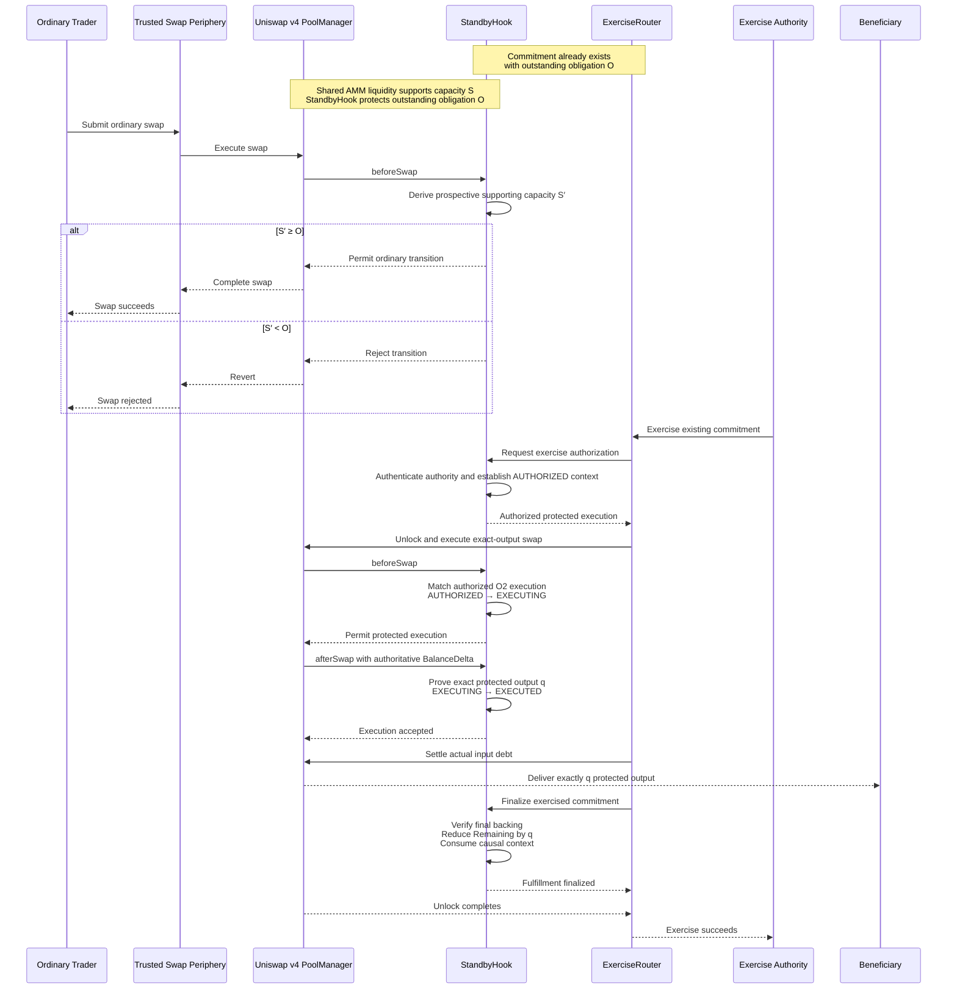
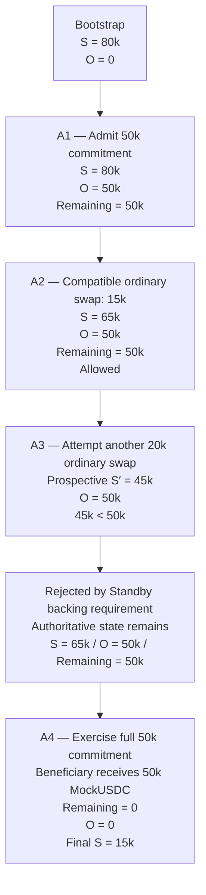

Perform one final bounded documentation-only update for the F10 judge-facing README artifacts.

This instruction has two responsibilities:

1. add the two **frozen, independently derived** Mermaid diagrams below to the root `README.md`;
2. correct two independently identified claim-boundary statements in `frontend/README.md`.

The two diagrams are **FROZEN for this update**.

Claude is not being asked to design diagrams. The Mermaid source below is the required diagram source. **Copy it exactly. Do not redesign, reinterpret, simplify, restyle, rename, reorganize, or regenerate either diagram.**

No protocol, frontend, script, test, deployment, bootstrap, or demo behavior is being changed.

---

# 1. Root README — Frozen Diagram 1: Standby Execution Paths

Modify:

`README.md`

Place Diagram 1 near the early conceptual/architectural explanation of Standby, after the reader has been introduced to the Standby thesis and the `S ≥ O` backing relationship, but before detailed implementation material.

Use a concise heading such as:

```markdown
## How Standby Executes
```

If an existing heading already provides the natural location, use that section rather than introducing a redundant heading.

Immediately before the diagram, add this paragraph exactly:

> The sequence below begins after a Standby commitment has already been admitted and an outstanding obligation `O` exists. It compares ordinary use of the shared AMM liquidity with later authorized exercise of that commitment.

Insert the following Mermaid source **exactly as written**:



Immediately after Diagram 1, add this explanatory paragraph exactly:

> **Both paths use the same shared Uniswap v4 liquidity.** Ordinary swaps execute through PoolManager with StandbyHook checking whether the prospective transition preserves sufficient supporting capacity. For commitment exercise, the authorized Exercise Authority initiates through ExerciseRouter; StandbyHook first authorizes and binds the exact exercise, PoolManager then performs the real exact-output AMM execution, the exerciser settles the resulting input debt, and PoolManager delivers the protected output directly to the Beneficiary. Only after execution, settlement, and delivery are proven does StandbyHook reduce the commitment’s Remaining Entitlement and consume the transaction-scoped causal context.

## Diagram 1 semantic boundary

Diagram 1 begins **after O1 commitment admission**.

It intentionally does not show the transaction that originally establishes the commitment.

The note:

```text
Commitment already exists
with outstanding obligation O
```

establishes that starting condition.

The diagram then compares two paths against the same shared Uniswap v4 liquidity:

### Ordinary path

```text
Ordinary Trader
→ Trusted Swap Periphery
→ PoolManager
↔ StandbyHook
```

StandbyHook evaluates the prospective supporting-capacity relationship and either permits or rejects the ordinary transition.

### Protected exercise path

Conceptually:

```text
Exercise Authority
→ ExerciseRouter
→ StandbyHook authorization
→ PoolManager execution
↔ StandbyHook execution evidence
→ settlement
→ direct Beneficiary delivery
→ StandbyHook finalization
```

Do not alter this responsibility assignment.

In particular, Diagram 1 must not imply that:

- StandbyHook initiates exercise;
- ExerciseRouter creates the commitment;
- Exercise Authority directly invokes PoolManager;
- ExerciseRouter is the protected-output recipient;
- StandbyHook is the protected-output recipient;
- ordinary swaps bypass StandbyHook;
- `beforeSwap` alone proves execution;
- authorization itself fulfills the commitment;
- settlement itself fulfills the commitment;
- delivery alone reduces Remaining;
- protected liquidity is segregated or reserved.

---

# 2. Root README — Frozen Diagram 2: Canonical Demo Sequence

Place Diagram 2 immediately before the primary demo/run instructions, or within the existing section that introduces the canonical A1–A4 judged sequence.

Use a concise heading such as:

```markdown
## Canonical Demo Sequence
```

Do not introduce a duplicate heading if an existing section already serves this purpose.

Insert the following Mermaid source **exactly as written**:



## Diagram 2 semantic boundary

Diagram 2 owns the **economic lifecycle of the canonical judged demonstration**.

Unlike Diagram 1, it begins before commitment admission and therefore shows where the outstanding obligation enters the system.

The canonical sequence must remain exactly:

```text
Bootstrap
S = 80k
O = 0

A1
Admit 50k commitment
S = 80k
O = 50k
Remaining = 50k

A2
Compatible ordinary protected exact-output swap = 15k
S = 65k
O = 50k
Remaining = 50k
Allowed

A3
Attempt additional ordinary protected exact-output swap = 20k
Prospective S′ = 45k
O = 50k
45k < 50k
Rejected

Post-A3 authoritative state:
S = 65k
O = 50k
Remaining = 50k

A4
Exercise full 50k commitment
Beneficiary receives exactly 50k MockUSDC
Remaining = 0
O = 0
Final S = 15k
```

Do not alter any canonical quantity or state transition.

Do not add a fifth live action.

Do not imply that prospective `S′ = 45k` becomes authoritative state during rejected A3.

---

# 3. Frozen Diagram Fidelity Requirement

Both Mermaid diagrams above are **FROZEN**.

For both diagrams:

- copy the supplied Mermaid source exactly;
- do not change `sequenceDiagram` or `flowchart TD`;
- do not change participant or node identifiers;
- do not rename actors;
- do not change labels;
- do not change arrow direction;
- do not change arrow type;
- do not combine participants or nodes;
- do not add participants or nodes;
- do not remove participants or nodes;
- do not reorder participants;
- do not reorder sequence operations;
- do not add Mermaid styles;
- do not add themes;
- do not add classes;
- do not add colors;
- do not add icons;
- do not add subgraphs;
- do not add custom Mermaid initialization directives;
- do not replace Mermaid with ASCII, SVG, PNG, generated images, or another diagram format;
- do not “improve” the layout;
- do not create an alternative diagram that expresses equivalent semantics.

The exact Mermaid source is part of the bounded documentation instruction.

If Markdown or Mermaid syntax prevents the supplied source from rendering, **do not silently change it**. Report the exact rendering/syntax issue instead.

Small placement adjustments to surrounding README headings are permitted only when required to integrate the frozen diagrams naturally into the existing README structure.

---

# 4. Frontend README — Reload / Authoritative-State Claim

Modify:

`frontend/README.md`

Locate the sentence equivalent to:

```text
A full page reload reconstructs everything from the chain alone.
```

This is too broad.

The frontend reconstructs **authoritative economic state** from production chain reads. Proposed demo transaction/configuration facts are supplied separately by the generated canonical demo manifest.

Replace the sentence with wording equivalent to:

```text
A full page reload reconstructs authoritative economic state from the chain; proposed demo transaction facts are loaded separately from the generated canonical demo manifest.
```

Preserve the surrounding explanation that the frontend holds no independent economic state and re-reads authoritative state after actions.

Do not change frontend behavior.

---

# 5. Frontend README — ABI / Build-Artifact Claim

In:

`frontend/README.md`

locate the statement equivalent to:

```text
the interface can never call a different interface than the deployed bytecode exposes
```

The intended architectural property is valid, but `can never` is unnecessarily absolute.

Replace it with wording equivalent to:

```text
The interface uses ABI definitions from the same Foundry build artifacts used by the canonical deployment, avoiding a separately maintained ABI that could drift from the deployed contracts.
```

Preserve the existing explanation of why `forge build` is a frontend prerequisite.

Do not change ABI loading or frontend implementation.

---

# 6. README Claim Boundaries

The diagrams and accompanying prose are judge-facing explanations of already accepted protocol behavior.

They must not introduce new protocol semantics.

Preserve these boundaries:

- Standby protects capacity; it does not reserve a dedicated liquidity slice.
- `S` is authoritative supporting capacity derived from protocol/pool state.
- `O` is the authoritative outstanding obligation.
- ordinary liquidity remains shared while the backing requirement remains satisfied.
- prospective state is not current authoritative state.
- the Exercise Authority initiates exercise.
- ExerciseRouter coordinates the trusted O2 execution path.
- StandbyHook owns authorization, execution classification/evidence, and causal finalization.
- actual AMM execution occurs through PoolManager.
- the authenticated exerciser economically supplies the actual required input.
- protected output is delivered directly from PoolManager to the authoritative Beneficiary.
- ExerciseRouter does not become protected-output custodian.
- StandbyHook does not become protected-output custodian.
- Remaining/O reduction occurs only through causal finalization after the required execution, settlement, and delivery conditions have been established.

Do not imply guaranteed execution independent of:

- validity;
- eligibility;
- authority;
- service-domain requirements;
- backing requirements;
- actual AMM execution conditions.

Do not imply F9T/testnet deployment is required.

---

# 7. Files Allowed to Change

Substantive documentation changes are allowed only in:

- `README.md`
- `frontend/README.md`

Also update:

- `docs/prompts/session-17-log.md`

for audit chronology only.

Do not modify:

- `src/**`;
- `test/**`;
- `script/**`;
- `frontend/src/**`;
- frontend package/configuration files;
- deployment/bootstrap artifacts;
- `docs/setup.md`;
- `.gas-snapshot`;
- gas-report evidence;
- coverage-report evidence;
- canonical protocol/specification artifacts;
- `docs/project-status.md`;
- F9/F9T status;
- existing implementation behavior.

---

# 8. Verification

This is documentation-only work.

Do not rerun:

- Solidity tests;
- invariant tests;
- gas snapshot;
- coverage;
- frontend build;
- frontend lint;
- demo environment;
- browser verification.

Instead, inspect the resulting diff and verify:

1. Diagram 1 is exactly the frozen sequence diagram supplied above.
2. Diagram 2 is exactly the frozen A1–A4 flowchart supplied above.
3. No participant, node, arrow, label, quantity, ordering, or state transition changed.
4. No Mermaid styling or additional Mermaid semantics were introduced.
5. Diagram 1 clearly begins after commitment admission.
6. Diagram 2 clearly contains commitment admission at A1.
7. Diagram 1 places `StandbyHook` immediately beside `ExerciseRouter`.
8. Exercise Authority remains external to that pair and initiates through ExerciseRouter.
9. Ordinary swaps visibly traverse PoolManager/StandbyHook enforcement.
10. O2 execution visibly traverses ExerciseRouter/PoolManager/StandbyHook.
11. Beneficiary delivery is direct from PoolManager.
12. No diagram implies reserved or segregated liquidity.
13. The root README remains consistent with its existing limitations/non-claims.
14. The frontend README distinguishes authoritative chain state from proposed demo facts.
15. The ABI statement no longer makes an unnecessary absolute guarantee.
16. No unrelated content changed.

If any frozen Mermaid source does not render, stop and report the exact problem rather than altering the source.

---

# 9. Session Evidence

Update:

`docs/prompts/session-17-log.md`

to record this instruction as the next material follow-up prompt and the resulting documentation-only action.

Update the material prompt count accordingly.

The session-log update is **audit chronology only**.

Do not rewrite or expand:

- the F10 implementation report;
- Human Interactive Browser Verification;
- prior correction reports;
- existing G10 evidence;
- the existing completion report;
- previously recorded test/gas/coverage evidence.

Record that:

- independent review of the judge-facing README artifacts led to two root README diagrams;
- Diagram 1 was iteratively derived and then verified against the completed F8A–F8D execution responsibilities before being frozen;
- Diagram 2 reflects the already accepted canonical A1–A4 economic sequence;
- both diagrams were supplied as frozen Mermaid source rather than delegated to Claude for diagram design;
- two frontend README claim-boundary statements were tightened;
- no implementation defect was identified;
- no verification suite was rerun because this work is documentation-only;
- the independently determined **G10 PASS / CLOSED** result was not reopened or reassessed.

Do not alter previously recorded chronology.

---

# 10. Gate Boundary

This documentation update does **not** reopen:

- F8A;
- F8B;
- F8C;
- F8D;
- GI;
- F9;
- F10;
- G10.

The independently reviewed result remains:

```text
F10 — Demo / Submission Readiness: COMPLETE
G10: PASS / CLOSED
```

This follow-up improves judge-facing representation of already accepted behavior.

Do not independently reassess or close G10.

---

# 11. Completion Boundary

Stop when:

1. frozen Diagram 1 is present in the root README at the intended conceptual/architectural location;
2. frozen Diagram 2 is present at the canonical demo location;
3. the exact explanatory prose for Diagram 1 is present;
4. both frontend README claim-boundary corrections are complete;
5. the session audit chronology records this material follow-up;
6. the material prompt count is updated;
7. the final diff has been checked against every frozen-diagram fidelity requirement above;
8. the exact files changed are reported.

Do not update `docs/project-status.md`.

Do not begin F9T.

Do not perform additional F10 implementation work.
