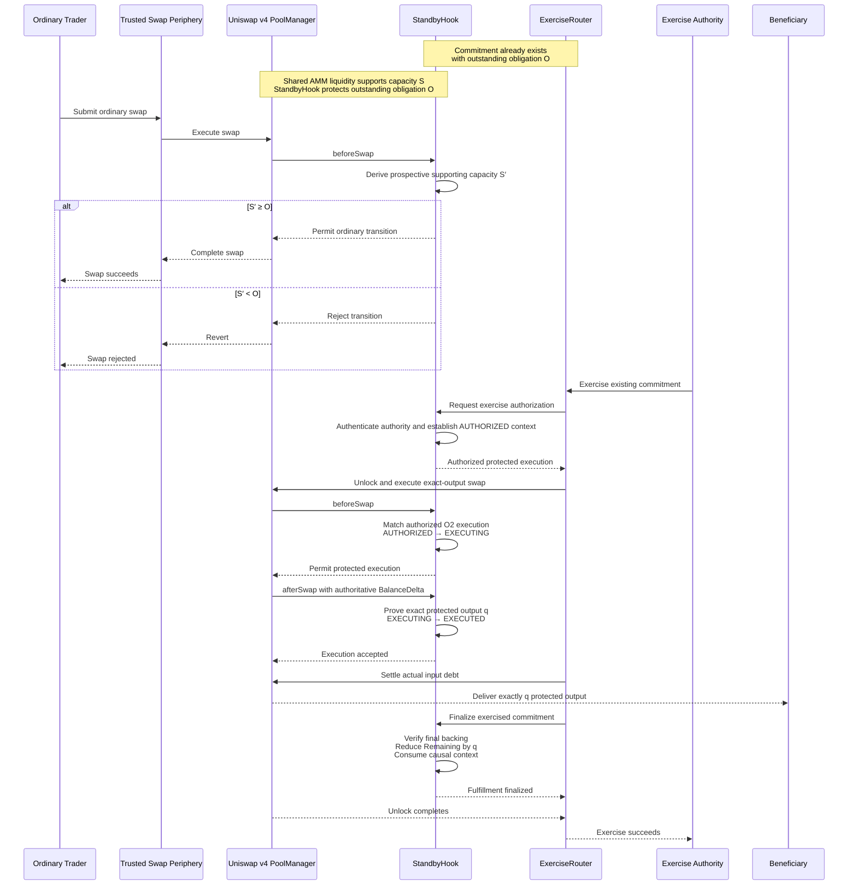
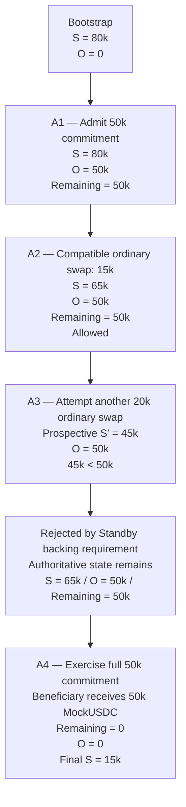

Before making any README or repository changes, perform a **visual-verification step only** for the two frozen Mermaid diagrams below.

Do **not** modify any file.

Do **not** update:

- `README.md`;
- `frontend/README.md`;
- `docs/prompts/session-17-log.md`;
- `docs/project-status.md`;
- or any other repository file.

The purpose of this step is solely to verify the rendered appearance of the two already-frozen diagrams before they are inserted into the judge-facing README.

## Diagram 1 — Standby Execution Paths

Render/display this Mermaid source **exactly as supplied**:

## Diagram 2 — Canonical Demo Sequence

Render/display this Mermaid source **exactly as supplied**:

## Fidelity Rules

Do not:

- redesign either diagram;
- change participant order;
- change node order;
- rename participants;
- rename nodes;
- change arrows;
- change labels;
- change quantities;
- add styling;
- add colors;
- add classes;
- add icons;
- add subgraphs;
- add Mermaid initialization directives;
- simplify either diagram;
- generate an alternative representation.

If the supplied Mermaid cannot render exactly as written, report the rendering problem rather than correcting it.

## Required Response

Display/render **Diagram 1 and Diagram 2** so they can be visually inspected.

Then report only whether:

1. each diagram rendered successfully;
2. the rendered source is exactly the supplied source;
3. any Mermaid rendering or layout problem was encountered.

**Stop after displaying the diagrams.**

Do not modify the repository.

Do not proceed to the README update.

Wait for explicit approval before taking any further action.
